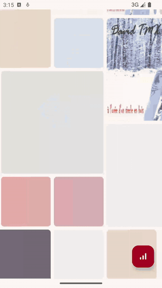

# MeetMusic

<p align="center">
  <strong>A Material-style Android music player powered by AndroidX Media3.</strong>
</p>

<p align="center">
  <a href="https://kotlinlang.org"></a>
  <a href="https://developer.android.com"></a>
  <a href="https://developer.android.com/media/media3"></a>
  
  <a href="LICENSE"></a>
</p>

<p align="center">
  English · <a href="README.zh-CN.md">简体中文</a>
</p>

<p align="center">
  <a href="#demo">Demo</a> ·
  <a href="#features">Features</a> ·
  <a href="#architecture">Architecture</a> ·
  <a href="#quick-start">Quick Start</a> ·
  <a href="#roadmap">Roadmap</a>
</p>

MeetMusic is an Android music player sample built with Kotlin and AndroidX Media3. It brings together online music streaming, `MediaLibrarySession`, foreground playback, FFT-based audio visualization, a Material-style settings experience, and a modular Android project structure. It is designed as a practical reference for learning Media3 playback flows, music app architecture, and custom audio processing.

## Demo

<table>
  <thead>
    <tr>
      <th>Android demo</th>
    </tr>
  </thead>
  <tbody>
    <tr>
      <td align="center">
        <a href="docs/assets/meetmusic-preview.mp4">
          
        </a>
      </td>
    </tr>
    <tr>
      <td><a href="docs/assets/meetmusic-preview.mp4">MP4</a></td>
    </tr>
  </tbody>
</table>

## Features

- Two-way feed: a custom two-way spanned grid on the home screen with horizontal and vertical edge loading plus blank-space prefetching.
- Online music source: fetches tracks, covers, artists, and stream URLs from the Jamendo API.
- Media3 playback core: organizes playback with `MediaLibraryService`, `MediaLibrarySession`, `MediaBrowser`, and `MediaController`.
- Background playback: supports foreground media playback, media notifications, playback queues, previous/next controls, and shuffle commands.
- Now Playing page: includes cover art, title, artist, seek bar, transport controls, and an FFT spectrum view.
- Audio visualization: a custom `FFTAudioProcessor` extracts frequency-domain data from PCM audio and sends it back to the UI through AIDL.
- Personalization: settings for language, dark mode, Material dynamic color/theme color, home feed spans, haptics, and cache clearing.
- Modular Android project: app UI, playback service, data source, settings, networking, and common utilities are split into focused modules.

## Architecture

```text
MeetMusic
├── app                 # App shell, home feed, now-playing page, app PlaybackService
├── core-player-service # Media3 session service, ExoPlayer setup, FFT audio processor
├── biz-data            # Jamendo API service, domain models, constants
├── biz-settings        # Settings screens, theme/language preferences, cache controls
├── lib-base            # Base Activity/Fragment, utils, storage helpers, UI helpers
├── lib-net             # Retrofit, OkHttp, RxJava network foundation
└── lib-material        # Shared icons and image resources
```

### Playback Flow

```text
FeedsFragment
  -> MediaBrowser.getChildren("root")
  -> DemoMediaLibrarySessionCallback
  -> TracksRepository
  -> JamendoService
  -> MediaItem list
  -> MediaController / ExoPlayer
  -> NowPlayingActivity
```

### Audio Visualization Flow

```text
ExoPlayer AudioSink
  -> FFTAudioProcessor
  -> ExtraService AIDL callbacks
  -> NowPlayingActivity
  -> FFTBandView
```

## Tech Stack

| Area | Stack |
| --- | --- |
| Language | Kotlin, Java |
| UI | Android Views, ViewBinding, Material Components |
| Playback | AndroidX Media3, ExoPlayer, MediaSession |
| Network | Retrofit, OkHttp, RxJava/RxAndroid |
| Images | Glide |
| Audio | Media3 `AudioProcessor`, paramsen/noise FFT |
| Build | Gradle 8.0, Android Gradle Plugin 8.1.2 |

## Quick Start

### Requirements

- Android Studio with Android Gradle Plugin 8.x support
- JDK 17
- Android SDK 34
- Android device or emulator running Android 5.0+

### Build

```bash
git clone <your-repo-url>
cd MeetMusic
./gradlew :app:assembleDebug
```

### Install

```bash
./gradlew :app:installDebug
```

You can also open the project directly in Android Studio, select the `app` run configuration, and install it on a device.

## Configuration

MeetMusic currently uses Jamendo as its online music source. The base URL is initialized in `DemoPlaybackService`, and the client parameter is maintained in `ConfigC` inside the `biz-data` module. Before publishing a production build, move API configuration to local config, build variables, or a backend proxy to avoid keeping production keys in source code.

## Permissions

| Permission | Why |
| --- | --- |
| `INTERNET` | Fetch music lists, audio streams, and cover images |
| `FOREGROUND_SERVICE` | Keep playback alive in a foreground service |
| `FOREGROUND_SERVICE_MEDIA_PLAYBACK` | Declare the Android 14+ media playback foreground service type |
| `RECORD_AUDIO` | Support audio visualization and spectrum-related capabilities |

## Development Notes

- `FeedsViewModel` maintains cached pages and prefetch requests to reduce visible blank space near scroll edges.
- `DemoMediaLibrarySessionCallback` converts Jamendo data into Media3 `MediaItem` objects and resolves playlists for media controllers.
- `FFTAudioProcessor` is inserted into the ExoPlayer audio rendering chain to preserve audio output while producing FFT data for the UI.
- The settings module stores preferences with `SPUtils` and broadcasts global changes, such as theme updates, through `RxBus`.

## Roadmap

- Add release signing and CI build workflow.
- Add unit tests for feed prefetching and media item conversion.
- Move API keys and remote config out of source code.
- Add app screenshots and Play Store style release notes.

## Acknowledgements

- [AndroidX Media3](https://developer.android.com/media/media3)
- [Jamendo API](https://developer.jamendo.com)
- [Material Components for Android](https://github.com/material-components/material-components-android)
- [Glide](https://github.com/bumptech/glide)
- [Retrofit](https://github.com/square/retrofit)

## License

This project is licensed under the GNU General Public License v3.0 or later. See [LICENSE](LICENSE) for details.

Some files retain their original upstream license headers, including Android Open Source Project Apache-2.0 snippets and GPL-licensed components. Keep those notices intact when redistributing or modifying the project.
